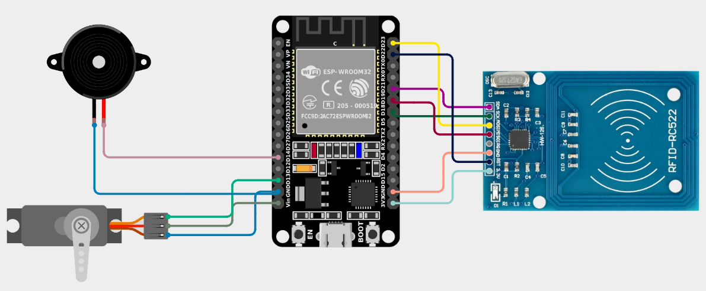

# ESP32-014-DIY-Smart-RFID-Door-Lock-with-ESP32🔐
This RFID Door Lock System uses an ESP32 and an RC522 RFID module to unlock doors using RFID cards. When an authorized card is scanned, the servo motor rotates to unlock the door, while the buzzer provides audio feedback — making it a compact, secure, and IoT-ready access control system.

---

## 🛠️ Components Used

1. [ESP32 Development Board (30 Pin)](https://robocraze.com/products/nodemcu-32-wifi-bluetooth-esp32-development-board30-pin?_pos=3&_psq=ESP32&_ss=e&_v=1.0)
2. [RC522 RFID 13.56MHz Reader/Writer Module](https://robocraze.com/products/rfid-rc522-mfrc?_pos=1&_psq=RFID&_ss=e&_v=1.0)
3. [SG90 Micro Servo Motor](https://robocraze.com/products/sg90-micro-servo-motor?_pos=1&_psq=Servo+motor+%28SG90%29&_ss=e&_v=1.0)
4. [Active Buzzer](https://robocraze.com/products/9-volts-buzzer-small?_pos=1&_sid=14176233d&_ss=r)
5. [Breadboard](https://robocraze.com/products/breadboard?_pos=3&_psq=BREADBOARD&_ss=e&_v=1.0)
6. [Jumper Wires](https://robocraze.com/products/f2m-jumper-wires-20cm-40pcs?_pos=1&_psq=JUMPER+WIRES&_ss=e&_v=1.0)

---

## 🎥 Project Demo

▶️ [Watch on YouTube](https://youtu.be/3DnDVmsBX7Q?si=FgGdRNcqI2hz-mOI)

---

## Circuit Diagram

---
